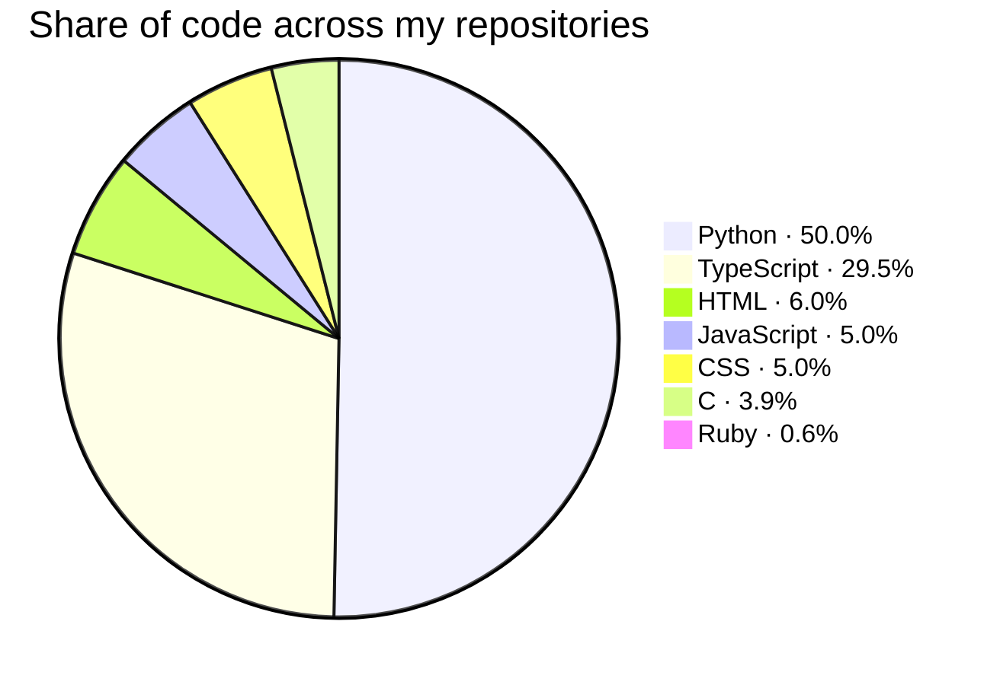
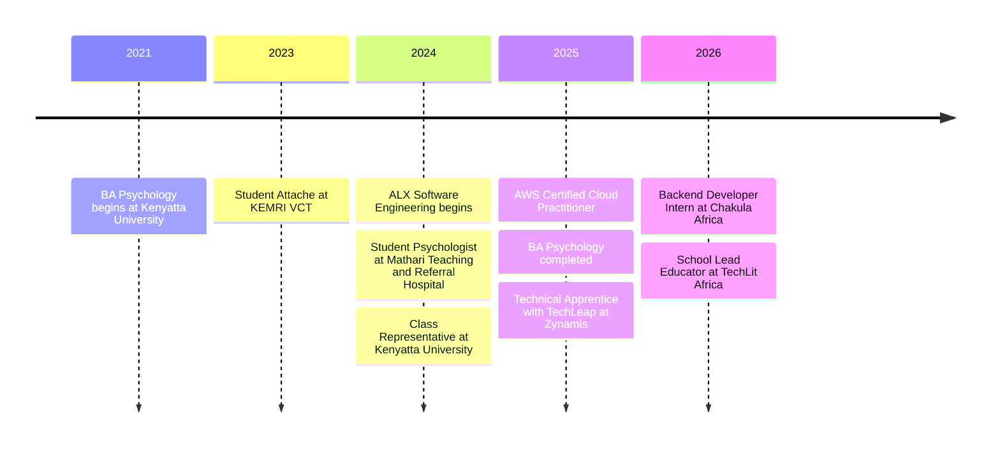

<div align="center">

<a href="https://kathfk1234.github.io/KathFK1234/" target="_blank" rel="noopener noreferrer">
  
</a>

<br><br>

<a href="https://kathfk1234.github.io/KathFK1234/" target="_blank" rel="noopener noreferrer"></a>&nbsp;&nbsp;&nbsp;&nbsp;&nbsp;<a href="https://www.linkedin.com/in/katheu-kilonzo-1a260422a/" target="_blank" rel="noopener noreferrer"></a>&nbsp;&nbsp;&nbsp;&nbsp;&nbsp;<a href="mailto:fkatheukilonzo@gmail.com" target="_blank" rel="noopener noreferrer"></a>

</div>

<br>

I build technology where human behavior, data, cloud infrastructure, and practical engineering meet. Psychology helps me understand the people; engineering lets me build for them.

Right now I am a **School Lead Educator at TechLit Africa**, leading hands-on digital literacy learning. Before that I was a **Backend Developer Intern at Chakula Africa**, building REST APIs and forecasting workflows for agricultural platforms.

<br>

## Why I build

<table>
<tr>
<th width="50%">Psychology taught me to ask</th>
<th width="50%">Engineering taught me to ask</th>
</tr>
<tr>
<td valign="top">

- Why do people behave the way they do?
- What creates friction?
- What makes a system useful instead of merely functional?

</td>
<td valign="top">

- How do we design reliable systems?
- How do we turn complexity into clarity?
- How do we build tools that create value for real people?

</td>
</tr>
</table>

<br>


<br>

## Toolbox

<!-- stack:start -->
<p align="center">
  <a href="https://github.com/KathFK1234?tab=repositories&language=python" title="Python"></a>&nbsp;&nbsp;&nbsp;<a href="https://github.com/KathFK1234?tab=repositories&language=html" title="HTML"></a>&nbsp;&nbsp;&nbsp;<a href="https://github.com/KathFK1234?tab=repositories&language=css" title="CSS"></a>&nbsp;&nbsp;&nbsp;<a href="https://github.com/KathFK1234?tab=repositories&language=javascript" title="JavaScript"></a>&nbsp;&nbsp;&nbsp;<a href="https://github.com/KathFK1234?tab=repositories&language=c" title="C"></a>&nbsp;&nbsp;&nbsp;<a href="https://github.com/KathFK1234?tab=repositories&language=typescript" title="TypeScript"></a>&nbsp;&nbsp;&nbsp;<a href="https://github.com/KathFK1234?tab=repositories&language=ruby" title="Ruby"></a>&nbsp;&nbsp;&nbsp;<a href="https://github.com/KathFK1234?tab=repositories&language=shell" title="Shell"></a>
</p>

<p align="center">
  <a href="#toolbox" title="FastAPI"></a>&nbsp;&nbsp;&nbsp;<a href="#toolbox" title="Django"></a>&nbsp;&nbsp;&nbsp;<a href="#toolbox" title="React"></a>&nbsp;&nbsp;&nbsp;<a href="#toolbox" title="Vite"></a>&nbsp;&nbsp;&nbsp;<a href="#toolbox" title="PostgreSQL"></a>&nbsp;&nbsp;&nbsp;<a href="#toolbox" title="Vitest"></a>&nbsp;&nbsp;&nbsp;<a href="#toolbox" title="Docker"></a>&nbsp;&nbsp;&nbsp;<a href="#toolbox" title="GitHub Actions"></a>
</p>

<p align="center">
  <a href="#toolbox" title="AWS"></a>&nbsp;&nbsp;&nbsp;<a href="#toolbox" title="Linux"></a>&nbsp;&nbsp;&nbsp;<a href="#toolbox" title="Git"></a>&nbsp;&nbsp;&nbsp;<a href="#toolbox" title="GitHub"></a>&nbsp;&nbsp;&nbsp;<a href="#toolbox" title="Figma"></a>&nbsp;&nbsp;&nbsp;<a href="#toolbox" title="Postman"></a>
</p>

<br>

| Found in my repositories | |
| --- | --- |
| **Languages** | Python · HTML · CSS · JavaScript · C · TypeScript · Ruby |
| **Backend** | FastAPI · SQLAlchemy · Pydantic · Django · SQLModel |
| **Frontend** | React · Vite |
| **Data & databases** | PostgreSQL |
| **Testing** | pytest · Vitest |
| **Infrastructure** | Docker · GitHub Actions · Railway · Docker Compose |

<sub>Detected automatically from 28 repositories (public and private) · last changed 2026-10-06</sub>
<!-- stack:end -->

<br>

| Area | What I work with |
| --- | --- |
| **Backend & systems** | Python · FastAPI · Django · Django REST Framework · PostgreSQL · SQL · authentication and business logic · API design |
| **Frontend** | React · TypeScript · Vite · HTML · CSS · JavaScript · interfaces that explain themselves |
| **Cloud & infrastructure** | AWS (Certified Cloud Practitioner) · Docker · Railway · Supabase · DigitalOcean · Linux · Git and GitHub workflows |
| **Testing & delivery** | pytest · Vitest · GitHub Actions · automated checks before every deploy |
| **AI & data** | LLM-powered applications · RAG systems · AI assistants · forecasting · data pipelines · human-AI interaction |
| **Product & research** | User-centered design · systems thinking · behavioral analysis · research-driven problem solving |

<br>

### Languages

<!-- languages:start -->
Python · HTML · CSS · JavaScript · C · TypeScript · Ruby


<!-- languages:end -->

<br>

## Featured work

<table>
<tr>
<td width="50%" valign="top">

### MoodForecast AI

Weather apps report conditions. This asks what those conditions mean for a person: live weather becomes a mood score with the reasons behind it, a week-ahead outlook, and a verdict on whether the weather suits your plans.

`Python` `FastAPI` `SQLModel` `Railway`

[Live demo](https://moodforecastai-production.up.railway.app) · [Source](https://github.com/KathFK1234/moodforecast_ai)

<br>

</td>
<td width="50%" valign="top">

### Murengeti Lab System

A computer lab management system for schools. It replaces scattered spreadsheets with one connected place for students, classes, timetables, attendance, equipment, and reports, and gives each school its own private workspace.

`FastAPI` `SQLAlchemy` `React` `TypeScript` `PostgreSQL`

Built for the school computer lab I lead · source is private

<br>

</td>
</tr>
<tr>
<td width="50%" valign="top">

### Healing Hive

Mental-health support for young people in Kenya: therapy and peer counselling with vetted professionals, private check-ins and journaling, and an AI companion whose crisis reply never depends on the AI being up. It began in 2025 as MindConnect, built with a team; in October 2026 I kept building it on my own as v2.

`Node.js` `Express` `MongoDB` `React` `Tailwind CSS`

<!-- source:healing-hive:start -->[Source](https://github.com/KathFK1234/Healing-Hive)<!-- source:healing-hive:end --> · v2: API and web app built, payments and SMS still to come · [v1, built with a team](https://github.com/derick-macharia/mindconnect-platform)

<br>

</td>
<td width="50%" valign="top">

### Chema Backend

A backend connecting agricultural knowledge, AI assistance, and decision support. Deliberately practical: useful output over impressive automation.

`FastAPI` `PostgreSQL` `Supabase` `Groq`

Built at Chakula Africa · source is private

<br>

</td>
</tr>
</table>

<br>

<!-- projects:start -->
**Lately**

| Project | Last change | What changed |
| --- | --- | --- |
| Healing Hive | 2026-10-06 | Link MindConnect to the team's repository, now that the fork is gone |
| Murengeti Lab System | 2026-10-06 | Report a week at a time, Saturday to Friday, with sections that fold away |
| MoodForecast AI | 2026-10-05 | Stop place lookups failing a search when the geocoder is slow |

<sub>Read from each project's repository every three hours.</sub>
<!-- projects:end -->

<br>

**Research and community**

- **Personality and friendship selection research** — worked in a five-person team, coordinated survey collection from 150+ respondents, and led the analysis.
- **Millennium Fellowship, Art Therapy Clubhouse** — co-led a team supporting 40+ youth through an art therapy initiative.
- **Mathematics Olympiad** — placed third regionally; analytical problem-solving was already part of the story.

<br>

## The path so far



<br>

## On GitHub

<div align="center">

<a href="https://github.com/KathFK1234"></a>

</div>

<br>

## Currently exploring

AI agents and agentic systems · backend architecture at scale · LLM-based products · cloud-native engineering · reliable ETL and forecasting workflows · API security · and the human questions that appear once a technical system reaches real users.

Beyond code, I am usually thinking, writing, drawing, or learning about psychology, creativity, and human connection.

<br>

## The terminal portfolio

**[kathfk1234.github.io/KathFK1234](https://kathfk1234.github.io/KathFK1234/)** is a working terminal. Type `help`, or try these:

| Try | What happens |
| --- | --- |
| `about` · `projects` · `skills` · `experience` | the short version of this page |
| `ls` · `cd projects/moodforecast-ai` · `tree` | browse real folders of notes and project write-ups |
| `cat README.md` · `grep friction` · `find mood` | read and search them |
| `mood nairobi` · `mood week tokyo` · `mood nairobi vs reykjavik` | live readings from the MoodForecast AI service: today's mood score and why, the week ahead, or two places side by side |
| `mood picnic in cape town` · `mood activities mombasa` | whether the weather suits a plan, and what is practical somewhere right now |
| `mood` · `mood surprise` · `mood api` | places to try, a place picked for you, and everything the service can do right now |
| `man mood` · `man grep` | a manual for every command, with examples you can click |
| `theme` · `font` · `crt` | change how the terminal looks |
| `stack` | languages and tools measured across my repositories |
| `updates` · `updates healing-hive` | the latest work on each project, read from its repository |
| `fortune` · `neofetch` · `coffee` · `sudo hire-me` | for the curious |

`Tab` completes commands and paths, `↑`/`↓` revisit history, and any highlighted command can be clicked or tapped. Add `?cmd=projects` to the URL to open the page with a command already run.

<details>
<summary><b>How it is built, and how to run it</b></summary>

<br>

Vite + React + TypeScript. The terminal's file system is the real [content/home/](content/home/) folder: add a file there and it appears in `ls`, `cat`, `grep`, `find`, and `tree`.

- A file named `_about` holds the one-line description of the folder it sits in.
- Any other file starting with `_` shows up as a hidden dotfile (`_secrets` becomes `.secrets`, visible with `ls -a`).
- Commands live in [src/shell/commands.tsx](src/shell/commands.tsx); `help` and `man` are generated from that list.

```bash
npm install
npm run dev      # local server with live reload
npm test         # shell, file system, and completion tests
npm run build    # type-check and build into dist/
```

Pushing to `main` builds and deploys the site through [.github/workflows/deploy.yml](.github/workflows/deploy.yml). In the repository settings, Pages → Source must be set to **GitHub Actions**.

**Languages and tools update themselves.** Every three hours (or on demand from the Actions tab → *Run workflow*), the same workflow runs [languages_update_script.py](languages_update_script.py). It reads every public repository I own — GitHub's language statistics, plus dependency files such as `requirements.txt`, `pyproject.toml` and `package.json` — and rewrites:

- the icon row, tools table, language list and pie chart in this README (between the `stack` and `languages` comment markers), and
- [src/data/stack.json](src/data/stack.json), which the site's `skills` and `stack` commands read.

The **On GitHub** card is the contribution calendar from my profile page, in this site's colours: [activity_card_script.py](activity_card_script.py) asks GitHub for the past year and uses the same days, the same counts and GitHub's own shade for each day. It is drawn on every run of the workflow, each push included, and published with the site instead of being committed, so the README always shows the newest one. GitHub caches images for a few minutes, so a fresh contribution can take a little while to appear.

**The `mood` command keeps up with MoodForecast AI.** Nothing about that service is written into the terminal by hand more than once:

- Each visit, `mood` first asks the live service what it offers (its OpenAPI description). Every `GET /api/<name>/{location}` endpoint is usable at once as `mood <name> <place>`, every other `GET /api/<name>` as `mood <name>`, and any field a response gains is shown, even before the terminal has a tailored view for it. `mood api` lists what it found.
- What the service says is passed on as it says it: its own error explanations, its questions about other places, its place suggestions when a name is mistyped, and its current list of activities (used for suggestions and Tab completion the same day one is added).
- The scheduled run also executes [mood_sync_script.py](mood_sync_script.py), which reads the endpoints plus the place lists and activities in the [moodforecast_ai](https://github.com/KathFK1234/moodforecast_ai) repository and writes [src/data/mood.json](src/data/mood.json). The terminal uses it for suggestions ("where next?"), Tab completion, and as a fallback when the service does not answer. The same run rewrites the endpoint list visitors can read in the terminal (`cat ~/projects/moodforecast-ai/API.md`).

**Project write-ups keep up with the projects.** The same scheduled run executes [projects_sync_script.py](projects_sync_script.py), which reads the history of every project listed at the top of that script and rewrites:

- the **Lately** table under *Featured work* (between the `projects` comment markers), and each project's source link, which turns into "source is private" on its own if a repository is made private,
- [src/data/projects.json](src/data/projects.json), which the terminal's `updates` and `projects` commands read, and
- a `CHANGELOG.md` in each project's folder under [content/home/projects/](content/home/projects/), readable in the terminal with `cat`.

A private repository's commit messages stay out of all three unless its entry in the script says `"share": True`; otherwise only its dates and commit count are shown.

Dates and commit lists look after themselves; the paragraphs I wrote about a project do not. So the script also records the commit each write-up was last revised at ([projects_reviewed.json](projects_reviewed.json)) and reports what has changed since. The scheduled run posts that as a notice on the workflow, and on my own machine the same check runs against the local clones, where it also sees work that is not pushed yet:

```bash
python3 projects_sync_script.py --check              # ask GitHub (GITHUB_TOKEN needed for private projects)
python3 projects_sync_script.py --check --local ..   # ask the clones next to this one
python3 projects_sync_script.py --mark-reviewed      # after revising the write-ups
```

To add a project, add a line to `PROJECTS` in the script and a folder for it under `content/home/projects/`.

To try MoodForecast AI changes that are not merged or deployed yet, run its backend locally and point both halves at it:

```bash
python3 mood_sync_script.py --source ../moodforecast_ai --api http://localhost:8000   # places, activities, endpoints
echo 'VITE_MOOD_API=http://localhost:8000' > .env.local                               # the site's live calls
npm run dev
```

(`git checkout src/data/mood.json content/home/projects/moodforecast-ai/API.md` puts the generated files back afterwards.)

The scheduled run commits its changes to `main`, so `git pull` before starting new work.

**Including private repositories.** By default only public repositories are scanned. To count private ones too, create a fine-grained personal access token (GitHub → Settings → Developer settings → Fine-grained tokens) with *All repositories* access and read-only **Contents** and **Metadata** permissions, then save it in this repository under Settings → Secrets and variables → Actions as a secret named `STACK_TOKEN`. Only totals are published — language sizes and tool names — never private repository names, which are also kept out of the workflow logs.

Only tools named in `KNOWN_PACKAGES` / `KNOWN_FILES` at the top of the script are reported; add a line there to teach it a new one. To run it by hand:

```bash
python3 languages_update_script.py --dry-run   # preview
python3 languages_update_script.py             # rewrite README and stack.json
```

</details>

<br>

## Let’s build something meaningful

I like working with people who are building thoughtful products, solving difficult problems, and asking deeper questions. If that sounds like you, let’s talk.

<div align="center">

<a href="https://www.linkedin.com/in/katheu-kilonzo-1a260422a/" target="_blank" rel="noopener noreferrer"></a>&nbsp;&nbsp;&nbsp;&nbsp;&nbsp;<a href="mailto:fkatheukilonzo@gmail.com" target="_blank" rel="noopener noreferrer"></a>&nbsp;&nbsp;&nbsp;&nbsp;&nbsp;<a href="https://github.com/KathFK1234" target="_blank" rel="noopener noreferrer"></a>

<br>

<sub>Build systems that make sense to people.</sub>

</div>
