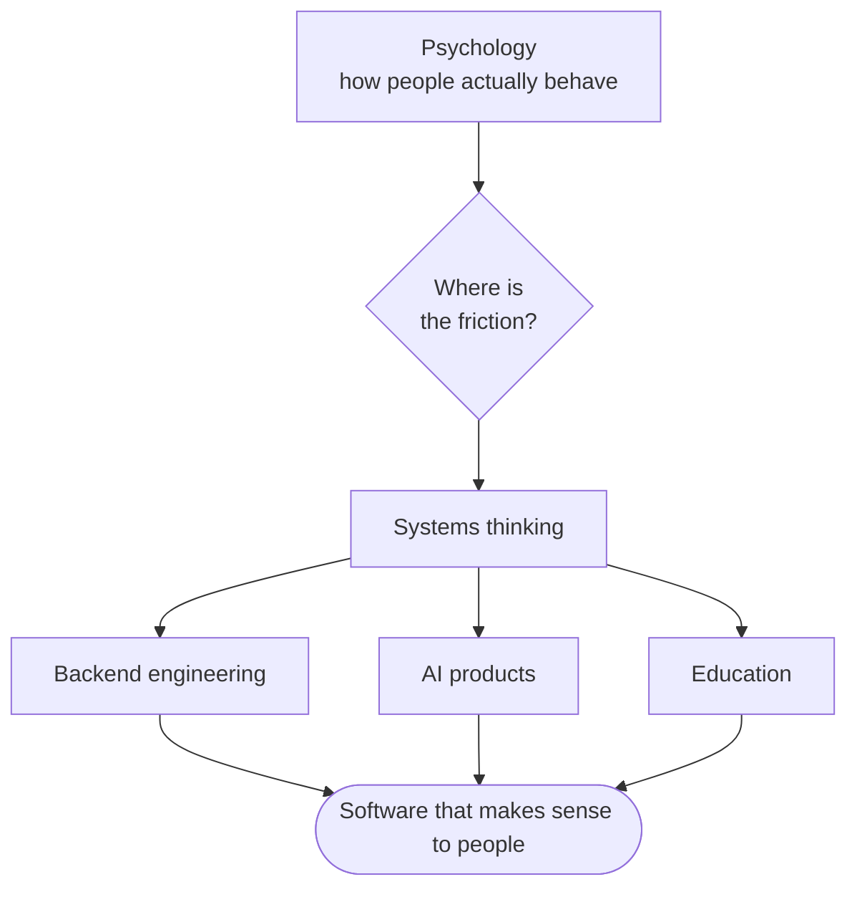
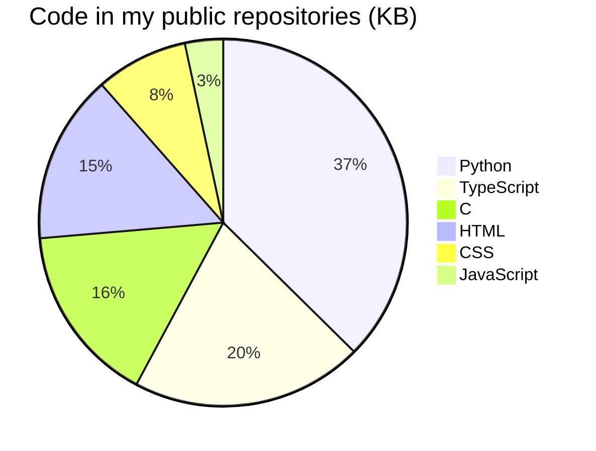
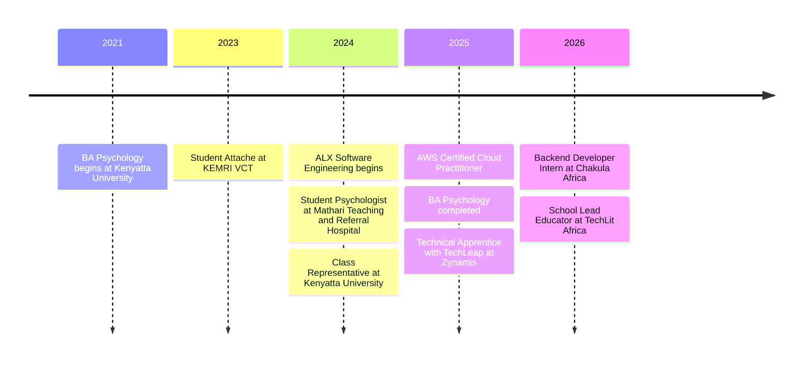

<div align="center">

<a href="https://kathfk1234.github.io/KathFK1234/" target="_blank" rel="noopener noreferrer">
  
</a>

<br><br>

<a href="https://kathfk1234.github.io/KathFK1234/" target="_blank" rel="noopener noreferrer"></a>&nbsp;&nbsp;&nbsp;&nbsp;&nbsp;<a href="https://www.linkedin.com/in/katheu-kilonzo-1a260422a/" target="_blank" rel="noopener noreferrer"></a>&nbsp;&nbsp;&nbsp;&nbsp;&nbsp;<a href="mailto:fkatheukilonzo@gmail.com" target="_blank" rel="noopener noreferrer"></a>

</div>

<br>

I build technology where human behavior, data, cloud infrastructure, and practical engineering meet. Psychology helps me understand the people; engineering lets me build for them.

Right now I am a **School Lead Educator at TechLit Africa**, leading hands-on digital literacy learning. Before that I was a **Backend Developer Intern at Chakula Africa**, building REST APIs and forecasting workflows for agricultural platforms.

<br>

## Why I build

<table>
<tr>
<th width="50%">Psychology taught me to ask</th>
<th width="50%">Engineering taught me to ask</th>
</tr>
<tr>
<td valign="top">

- Why do people behave the way they do?
- What creates friction?
- What makes a system useful instead of merely functional?

</td>
<td valign="top">

- How do we design reliable systems?
- How do we turn complexity into clarity?
- How do we build tools that create value for real people?

</td>
</tr>
</table>

<br>



<br>

## Toolbox

<!-- stack:start -->
<div align="center">


</div>

<br>

| Found in my repositories | |
| --- | --- |
| **Languages** | Python · HTML · CSS · C · JavaScript · TypeScript |
| **Backend** | FastAPI · Pydantic · SQLAlchemy · Django · SQLModel |
| **Frontend** | React · Vite |
| **Data & databases** | PostgreSQL |
| **Testing** | pytest · Vitest |
| **Infrastructure** | Docker · GitHub Actions · Railway |

<sub>Detected automatically from 21 public repositories · last changed 2026-10-04</sub>
<!-- stack:end -->

<br>

| Area | What I work with |
| --- | --- |
| **Backend & systems** | Python · FastAPI · Django · Django REST Framework · PostgreSQL · SQL · authentication and business logic · API design |
| **Cloud & infrastructure** | AWS (Certified Cloud Practitioner) · Docker · Railway · Supabase · DigitalOcean · Linux · Git and GitHub workflows |
| **AI & data** | LLM-powered applications · RAG systems · AI assistants · forecasting · data pipelines · human-AI interaction |
| **Product & research** | User-centered design · systems thinking · behavioral analysis · research-driven problem solving |

<br>

### Languages

<!-- languages:start -->
Python · HTML · CSS · C · JavaScript · TypeScript


<!-- languages:end -->

<br>

## Featured work

<table>
<tr>
<td width="33%" valign="top">

### MoodForecast AI

Weather apps report conditions. This asks what those conditions mean for a person: live weather becomes a mood score, an energy level, and concrete recommendations.

`Python` `FastAPI` `SQLModel` `Railway`

[Live demo](https://moodforecastai-production.up.railway.app) · [Source](https://github.com/KathFK1234/moodforecast_ai)

</td>
<td width="33%" valign="top">

### MindConnect

A mental-health support concept designed around the realities of young people in Kenya: accessible, empathetic, and clear about the next step.

`Figma` `MongoDB` `Express` `Node.js`

[Source](https://github.com/derick-macharia/mindconnect-platform) · concept work, built with a team

</td>
<td width="33%" valign="top">

### Chema Backend

A backend connecting agricultural knowledge, AI assistance, and decision support. Deliberately practical: useful output over impressive automation.

`FastAPI` `PostgreSQL` `Supabase` `Groq`

Built at Chakula Africa · source is private

</td>
</tr>
</table>

<br>

**Research and community**

- **Personality and friendship selection research** — worked in a five-person team, coordinated survey collection from 150+ respondents, and led the analysis.
- **Millennium Fellowship, Art Therapy Clubhouse** — co-led a team supporting 40+ youth through an art therapy initiative.
- **Mathematics Olympiad** — placed third regionally; analytical problem-solving was already part of the story.

<br>

## The path so far



<br>

## On GitHub

<div align="center">


</div>

<br>

## Currently exploring

AI agents and agentic systems · backend architecture at scale · LLM-based products · cloud-native engineering · reliable ETL and forecasting workflows · API security · and the human questions that appear once a technical system reaches real users.

Beyond code, I am usually thinking, writing, drawing, or learning about psychology, creativity, and human connection.

<br>

## The terminal portfolio

**[kathfk1234.github.io/KathFK1234](https://kathfk1234.github.io/KathFK1234/)** is a working terminal. Type `help`, or try these:

| Try | What happens |
| --- | --- |
| `about` · `projects` · `skills` · `experience` | the short version of this page |
| `ls` · `cd projects/moodforecast-ai` · `tree` | browse real folders of notes and project write-ups |
| `cat README.md` · `grep friction` · `find mood` | read and search them |
| `mood nairobi` | calls the live MoodForecast AI service |
| `theme` · `font` · `crt` | change how the terminal looks |
| `stack` | languages and tools measured across my repositories |
| `fortune` · `neofetch` · `coffee` · `sudo hire-me` | for the curious |

`Tab` completes commands and paths, `↑`/`↓` revisit history, and any highlighted command can be clicked or tapped. Add `?cmd=projects` to the URL to open the page with a command already run.

<details>
<summary><b>How it is built, and how to run it</b></summary>

<br>

Vite + React + TypeScript. The terminal's file system is the real [content/home/](content/home/) folder: add a file there and it appears in `ls`, `cat`, `grep`, `find`, and `tree`.

- A file named `_about` holds the one-line description of the folder it sits in.
- Any other file starting with `_` shows up as a hidden dotfile (`_secrets` becomes `.secrets`, visible with `ls -a`).
- Commands live in [src/shell/commands.tsx](src/shell/commands.tsx); `help` and `man` are generated from that list.

```bash
npm install
npm run dev      # local server with live reload
npm test         # shell, file system, and completion tests
npm run build    # type-check and build into dist/
```

Pushing to `main` builds and deploys the site through [.github/workflows/deploy.yml](.github/workflows/deploy.yml). In the repository settings, Pages → Source must be set to **GitHub Actions**.

**Languages and tools update themselves.** Once a day (or on demand from the Actions tab → *Run workflow*), the same workflow runs [languages_update_script.py](languages_update_script.py). It reads every public repository I own — GitHub's language statistics, plus dependency files such as `requirements.txt`, `pyproject.toml` and `package.json` — and rewrites:

- the icon row, tools table, language list and pie chart in this README (between the `stack` and `languages` comment markers), and
- [src/data/stack.json](src/data/stack.json), which the site's `skills` and `stack` commands read.

The daily run commits its changes to `main`, so `git pull` before starting new work.

Only tools named in `KNOWN_PACKAGES` / `KNOWN_FILES` at the top of the script are reported; add a line there to teach it a new one. To run it by hand:

```bash
python3 languages_update_script.py --dry-run   # preview
python3 languages_update_script.py             # rewrite README and stack.json
```

</details>

<br>

## Let’s build something meaningful

I like working with people who are building thoughtful products, solving difficult problems, and asking deeper questions. If that sounds like you, let’s talk.

<div align="center">

<a href="https://www.linkedin.com/in/katheu-kilonzo-1a260422a/" target="_blank" rel="noopener noreferrer"></a>&nbsp;&nbsp;&nbsp;&nbsp;&nbsp;<a href="mailto:fkatheukilonzo@gmail.com" target="_blank" rel="noopener noreferrer"></a>&nbsp;&nbsp;&nbsp;&nbsp;&nbsp;<a href="https://github.com/KathFK1234" target="_blank" rel="noopener noreferrer"></a>

<br>

<sub>Build systems that make sense to people.</sub>

</div>
